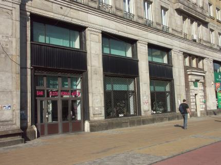
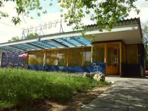
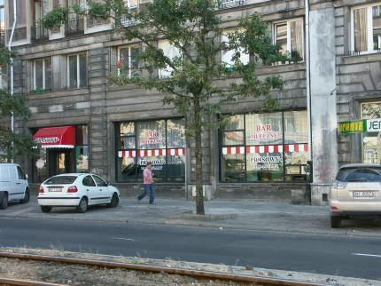
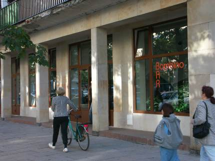
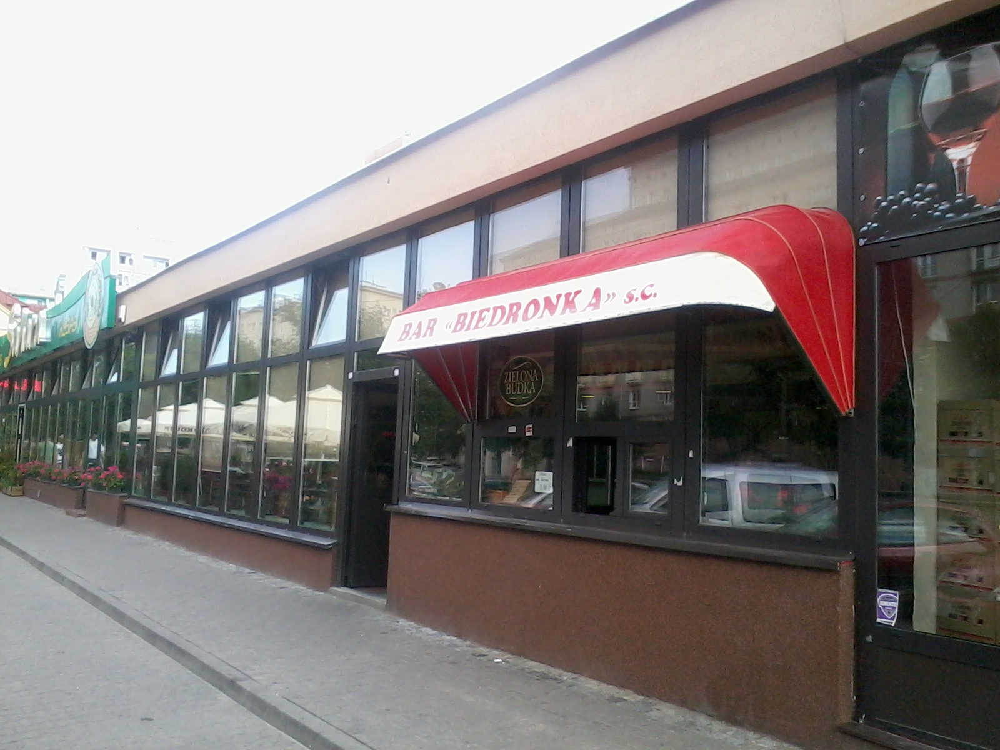
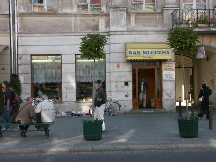
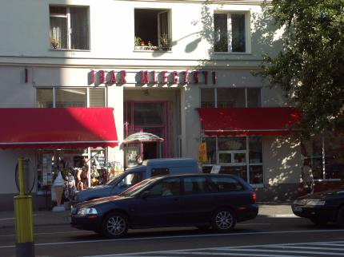
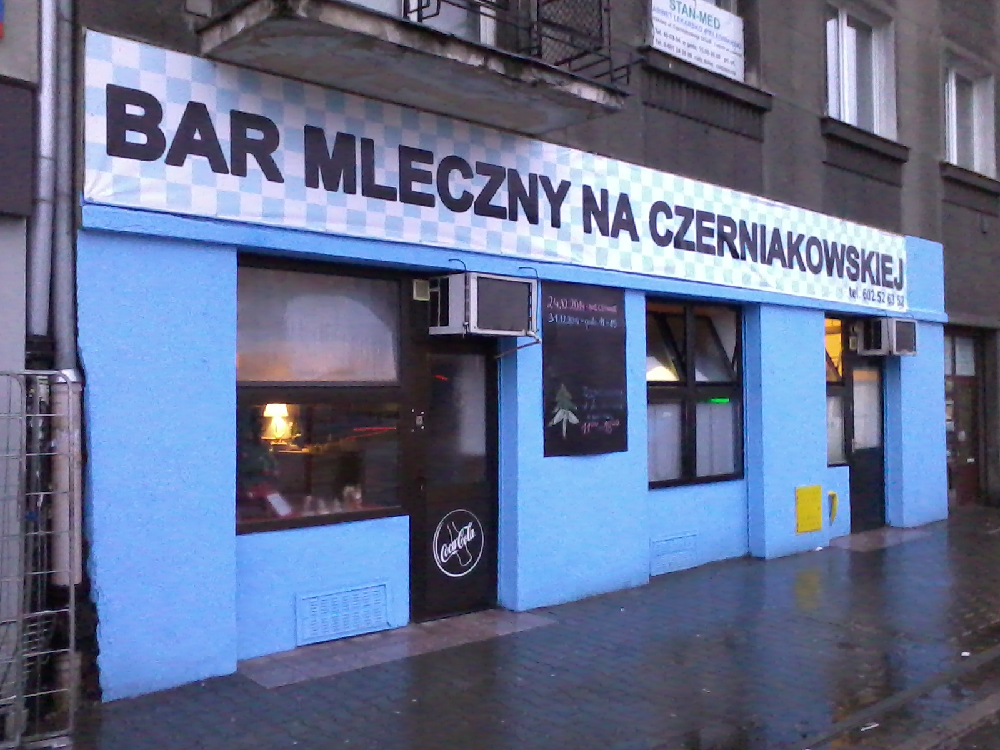
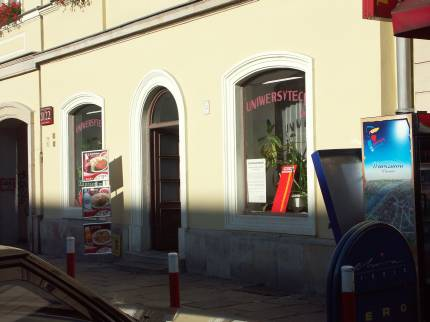

# Bary mleczne w Warszawie

## Działające

### Złota Kurka

*miasto:*  Warszawa     
*nazwa:*  Złota Kurka  :star::star::star::star:  
*adres:*  **ul. Marszałkowska 55/73** ([mapa](https///maps.google.com/maps?q=marsza%c5%82kowska+55%2f73+warsaw+poland&hl=en&ie=utf8&ll=52.22375121.01499&spn=0.0052510.010568&t=m&om=1&hnear=marsza%c5%82kowska+55%2f73+warszawa+mazowieckie+poland&z=17)), http://www.barzlotakurka.pl/  
*opis:*  Ostatnio będąc w Warszawie koleżanka powiedziała dla mnie: "Nie idź ty Piotrek do innego baru mlecznego, tylko do Złotej Kurki", który uprzednio był dla mnie nieznany. Bar ten mieści się przy ulicy Marszałkowskiej koło placu Konstytucji. Wszedłszy witają nas na ścianach dwie ładne mozaiki: przedstawiające zwierzęta domowe, coś w stylu socrealu z lat 60-tych, tak na mój gust. Ale prawdziwy zachwyt przeżyłem spojrzawszy na jadłospis znajdujący się na ścianie; wybór (zwłaszcza jak chodzi o wegetki) nie jest może aż taki jak w poznańskim barze "Pod Arkadami", ale ceny naprawdę dorównują tej legendzie barów mlecznych. Wybrałem sobie następujący zestaw: kasza gryczana bez tłuszczu, do tego pieczarki duszone w śmietanie, do tego surówka z czerwonej kapusty, do tego kisiel ze śmietaną i kakao. W sumie zapłaciłem 2 złote 90 groszy, a nażarłem się jak przysłowiowa małpa kitu, naprawdę na porcjach tam nie oszczędzają. Poza tym ziemniaki bez tłuszczu kosztują 22 grosze i są smaczne. Potrawa jakiej nie polecam to ryż ze śmietaną i cukrem - zresztą w mało którym barze umieją to zrobić dobrze.; Ogólnie oceniam, że jest to najlepszy bar mleczny w Warszawie - z tych, w których bywałem. Dopisek: w sumie bar niemalże kultowy; tu odbyło się spotkanie grupy artystycznej "Fabryka Kaszlu"    
Dopisek: jak studiowałem to złota kura mnie żywiła zdrowo i obficie. polecam zestaw zimowy: grochowa, kasza gr + sadzone, marchewka zasmażana i letni: chłodnik z jajkiem, naleśniki z serem p.s. pozdrawiam panią kasjerkę. minęło parę lat a kiedy ostatnio zaszedłem do Złotej Kury przy okazji to mnie poznała i pamiętała co zazwyczaj zamawiałem. słabo?  
Darmowe WiFi dla klientów! :)  
*godziny otwarcia:*  Poniedziałek - Piątek 7.00 - 19.00, Sobota - Niedziela 9.00 - 17.00    
*informator:*  [:Zerro](/zerro), [:filips](/filips)    
*aktualizacja:*  2014   

### Sady

*miasto:*  Warszawa     
*nazwa:*  Sady (miejscowi nazywają: "U dziada") :star::star::star::star::star:  
*adres:* ** róg Broniewskiego i Krasińskiego (przystanek Sady Żoliborskie**)    
*przykładowe ceny:*  omlet z pieczarkami: 4.35, mleczna (ryż lub makaron): 1.65, pomidorowa (ryż lub makaron): 1.79, botwinka z jajkiem 2.50, fasolowa 2.04, jajecznica na maśle: 1.92, bułka kajzerka .50, jajecznica na kiełbasie 2,10 a na boczku 2,35 a na słoninie 2.05, jajo gotowane 0.80, kefir 1.84, kapusta zasmażana 2.33, buraczki zasmaż 1,89, mizeria ze śmietaną 1.85, leniwe z masłem i cukrem 3.23, makaron ze śmietaną i cukrem 1.49, makaron z jajami sadzonymi 3.32  
Aktualizacja: Bukiet surówek: 2.24, kompot: 1.30, zupa pieczarkowa: 2.55, żur z jajem: 2.32, makaron z jajami sadzonymi: 3.36. 
*opis:*  [zerro]: Ostatnio za namową [FilipSa](/filips) wybrałem się do "Sadów". Był słoneczny poranek, wszedłem -- i szok! Nie śmierdzi, nie ma meneli, ładnie, niebiesko-żółto... Miła obsługa, łagodne ceny... Naprawdę, można tam nawet dziewczynę na randkę zaprosić. Od dziś to jest dla mnie no 1 w stolicy. Nie polecam: ryżu z owocami (zimny, nieszczególny). Polecam: omlet z pieczarkami. Sztućce blaszane. Na ścianie (koło kasy) zdjęcie przedstawiające pracowników baru z Krzysztofem Ibiszem.    
*godziny otwarcia:*  pn-pt 07:00-19:00, sob-ni i św 09:00-17:00    
*informator:*  [:filips](/filips), Michał Segit, [:Zerro](/zerro)    
*aktualizacja:*    jesień 2005, wiosna 2007    

### Mleczarnia

Pięć barów mlecznych w Warszawie. [www](http://www.mleczarniajerozolimska.pl/)  

*miasto:* Warszawa  
*nazwa:* Mleczarnia  
*adres: al. Jerozolimskie 32* [www](http://www.mleczarniajerozolimska.pl/)  
pon.-pt. 9-20, sob.-niedz. 11-19  
*informator:* [:filips](/filips)  
*aktualizacja:* zima 2013

*miasto:* Warszawa  
*nazwa:* Mleczarnia  
*adres:* ul. Bagatela 15 [www](http://www.mleczarniajerozolimska.pl/)  
pon.-pt. 9-20, sob.-niedz. 11-19  
*informator:* [:filips](/filips)  
*aktualizacja:* zima 2013

*miasto:* Warszawa  
*nazwa:* Mleczarnia  
*adres:* ul. Sienna 83 (wejście od Żelaznej) [www](http://www.mleczarniajerozolimska.pl/)  
pon.-pt. 9-20, sob.-niedz. 11-19  
*informator:* [:filips](/filips)  
*aktualizacja:* zima 2013

*miasto:* Warszawa  
*nazwa:* Mleczarnia  
*adres:*  ul. Nowowiejska 6 [www](http://www.mleczarniajerozolimska.pl/)  
pon.-pt. 9-20, sob.-niedz. 11-19  
*informator:* [:filips](/filips)  
*aktualizacja:* zima 2013

*miasto:* Warszawa  
*nazwa:* Mleczarnia  
*adres:* ul. Emilii Plater 47  [www](http://www.mleczarniajerozolimska.pl/)  
pon.-pt. 9-20, sob.-niedz. 11-19  
*informator:* [:filips](/filips)  
*aktualizacja:* zima 2013

### Prasowy

*miasto:*  Warszawa     
*nazwa:*  Prasowy    
*adres:*  **ul. Marszałkowska 10/16  **  [www](https///pl-pl.facebook.com/prasowy)  
*przykladowe ceny:*  grochowa 1.62, kasza gryczana+sos pieczarkowy 1.58, ziemniaki 1.12, jabłka prażone (1 duża łyżka papki!) 0.4    
*opis:*  Filips: "Duży wybór, niskie ceny, w centrum (rzut beretem od metra Politechnika); mniejszy tłok niż w "Złotej Kurce" (-) stosunkowo mała sala konsumpcyjna, (UWAGA) do leniwych dodają b. dużo masła, a do surówek dużo śmietany (jak ktoś nie lubi)". Michał Segit: "generalnie pustawo, poza godzinami szczytu obiadowego... wybór, atmosfera OK". Zerro: "Mi się podoba, może nawet bardziej niż w Złotej Kurce".    
*informator:*  [:filips](/filips), Michał Segit, [:zerro](/zerro)    
*aktualizacja:*    19.09.2001    

### Jadłodajnia

*miasto:*  Warszawa     
*nazwa:*  Jadłodajnia  
*adres:*  **ul. Stalowa**    
*przykladowe ceny:*  zupy od 2.00 do 3.00, naleśniki 5.00  
*opis:*  Kultowa knajpa  o niezbyt zachęcającej nazwie. Spotkasz tu klientów opieki społecznej ale i studentów oraz przedstawicieli lokalnej bohemy. Jedzenie wyborne porcje olbrzymie. Dużo wariacji daniowych z mleczności to chyba już tylko klimat :)) Polecam naleśniki z fetą i szpinakiem :))  
*godziny otwarcia:*  10-19   
*informator:*  [:Jurcyś](/jurcyś)    
*aktualizacja:*  lato 2006   

### Małe co nieco

*miasto:*  Warszawa     
*nazwa:*  hm, nie pamiętam  
*adres:*  **ul. Targowa 34** ([mapa](https///maps.google.com/maps?q=targowa+34+warsaw+poland&hl=en&ll=52.25049921.041125&spn=0.0052480.010568&t=m&om=1&hnear=targowa+34+warszawa+mazowieckie+poland&z=17))   
*przykladowe ceny:*  zupy od 2.50 do 3.00, naleśniki 4.00  
*opis:*  Kilka dni temu zauważyłem, że na Targowej, w miejscu, gdzie kiedyś był KFC, otwarli bar mleczny - to właśnie on. Jeszcze w nim nie jadłem, ale na oko wygląda porządnie.
nowy wpis 2007-02-23  
zjedliśmy tam obiad, pani kierownik(kasjerka) sprawiała wrażenie bycia na gazie, do tego obrażona. Zapytałem o zupę jarzynową - nie ma, omlet - nie ma, zapytałem: a co jest?? Reszta jest!!
Szczerze nie polecam, no chyba ze ktoś jest b.głodny i chce poczuć klimat lat 80-tych :D  
*godziny otwarcia:*  nie pamiętam   
*informator:*  [:Zerro](/zerro)    
*aktualizacja:*  lato 2006   

### Bambino

*miasto:*  Warszawa     
*nazwa:*  Bambino    

*adres:*  **Krucza 21  **  
*przykladowe ceny:*  naleśniki ser 2.5, dżem 2.8, jarzynowa 2.3, ogórkowa 1.8, pomidorowa 1.2?, owocowa (zimna) 1.75, mizeria 1.05, ziemniaki 1.1, kompot 0.65, surówki z marchewki brak, marchewka z groszkiem 1.5    
*opis:*  Bardzo mały wybór, nienajniższe ceny. Duża sala posiłkowa, łatwo o miejsce siedzące; dobre żarcie (naleśniki z jabłkami, z serem). Plastikowe sztućce. Michał S. nie zgadza się z tym opisem i pisze, że "nieźle; nie ma na ogół tłumu... ładnie, czysto".
Komentarz (2008.01): Bar przeszedł remont chyba około połowy 2007 roku. Obecnie jest to chyba najbardziej elegancki bar mleczny w Warszawie.
Natomiast ceny nadal typowo "barowo-mleczne" tzn. stosunkowo niewysokie. W efekcie, można spotkać ludzi dobrze usytuowanych, wyglądających i zachowujących się, jak np. wiele osób po studiach, pracujących, wpadających na "lunch" (w postaci oczywiście typowo polskiego pełnego obiadu) czy wieczorem, słychać obce języki; w przeciwieństwie do innych barów nie widać za to meneli. (M.S.)  
W listopadzie 2008 bar był w remoncie.
*godziny otwarcia:*  8-20, sob i św. 9-17  (aktualizacja: jesień 2005)  
*informator:*  [:filips](/filips), Ula S., Michał Segit, Jerzy Gzula    
*aktualizacja:*    18.11.2008 

### Biedronka

*miasto:*  Warszawa     
*nazwa:*  Biedronka    
*adres:*  **ul. Grójecka** 79    
*przykladowe ceny:*  jest średnio tani, tzn. aby zjeść sensownie poniżej 5zl to trudne... to się da, ale niezbyt wyszukane (a raczej: właśnie specjalnie wyszukane w menu), max raczej 2, w porywach 3 rzeczy tylko...! Zdarzają się przypadki bardzo złego towarzystwa, tj. niewyganianych bezdomnych, którzy zniechęcają ludzi zapachem do jedzenia i zjadają ich dania.   
*informator:*  Michał Segit, filips    
*aktualizacja:*    jesień 2001, 2014    

### Familijny

*miasto:*  Warszawa     
*nazwa:*  Familijny    

*adres:*  **ul. Nowy Świat 39  **  
*opis:*  Dość dobry bar, ekskluzywnie położony na Nowym Świecie. Polecam szczególnie zupę ogórkową, kotlet wege i sałatki. Ceny przystępne, w przypadku zup z jajkiem głównie cenę podnosi owo jajko. Dania wege i dla mięsożerców. W lipcu, gdy mniejszy tłok - świetne śniadania. Czysto, a na blacie przy pani sprzedającej dania stoi Legendarna Kasa Oka!!! 
*aktualizacja:* 29 kwietnia 2006 

### Gdański

*miasto:*  Warszawa     
*nazwa:*  Gdański    
*adres:*  **ul. Gen. Andersa 33  **  
*przykladowe ceny:*  naleśniki z serem: 4.57, omlet z dżemem: 5.52, jajecznica: 2.77, leniwe: 3.30, pomidorowa z ryżem: 2.41    
*opis:*  Typowy bar. Dość obskurny, całkiem smaczny. Niestety, drogi.    
*godziny otwarcia:*  pn-pt 10:00-17:30, sob 10:00-16:00    
*aktualizacja:*    wiosna 2005    

### Malwa

*miasto:*  Warszawa     
*nazwa:*  Malwa    
*adres:*  **ul. Conrada 11  **  
*przykladowe ceny:* pomidorowa: 3.50, pierogi: 6.00-6.50, budyń 2.00, herbata 1.00, kompot 2.00, placek po zbójnicku 10.00 
*opis:* dużo kwiatów (żywych i sztucznych), ściany w drewnie, talerze i sztućce z czasów PRLu, sympatycznie, ale niezbyt tanio.  
*godziny otwarcia:*  pn-pt 8:00-18:00, sob 10:00-16:00    
*informator:*  [Marcin](http://www.unipress.waw.pl/~wojdyr/)    
*aktualizacja:* lato 2006  

### Rusałka

*miasto:*  Warszawa     
*nazwa:*  Rusałka    
*adres:*  **ul. Floriańska** 14    
*aktualizacja:* przed latem 2001  

### Słoneczny

*miasto:*  Warszawa     
*nazwa:*  Słoneczny    
*adres:*  **ul. Mokotowska 39**    
*aktualizacja:* przed latem 2001  

### Wilanowski

*miasto:*  Warszawa     
*nazwa:*  Wilanowski    

*adres:*  **ul. Belwederska 2**    
*przykladowe ceny:*  Niestety, ceny nienajniższe, lecz ciągle konkurencyjne w stosunku do nieBarówMlecznych    
*opis:*  Z cyklu wycieczek niedzielnych odwiedziłem dziś bar mleczny Wilanowski w Warszawie. Pierwsza rzecz dla której warto tam pójść jest - uwaga! - OKA - Obliczeniowa Kasa Automatyczna - czyli taki stary gruchot co kiedyś w każdym sam-ie stal. Po drugie - dość duży wybór; niestety, ceny nienajniższe, lecz ciągle konkurencyjne w stosunku do nieBarowMlecznych. Co więcej, jest łatwo dojechać autobusami 195, 503 i innymi, z centrum. Polecam.    
*informator:*  [:filips](/filips)    
*aktualizacja:*    czerwiec 2002    

### Pod Barbakanem

*miasto:*  Warszawa     
*nazwa:*  pod Barbakanem    
*adres:*  **Warszawa ul. Mostowa 27/29**    
*przykladowe ceny:*  pomidorowa 2.00, pieczarkowa 2.50, ziemniaki 2.00, sałatka z czerwonej kapusty 1.50 (za 100 g), sałatka z białej 2.00 (100 g)    
*opis:*  tel (022) 8314737. Blaszane sztućce. Całkiem ładny wystrój. Na samej starówce. Jedna pani w kasie jest bardzo miła i pyta jak smakuje a druga nie. Duża zaleta: jest koło baru barierka, do której można przypiąć rower i wtedy jak się usiądzie przy odpowiednim stoliku to ma się rower na oku przez okno.  
Wady: smak potraw  
*godziny otwarcia:*  8.00-18.00    
*informator:*    [:Zerro](/zerro)    
*aktualizacja:*  lato 2006    
został zlikwidowany 1.01.2020
### Kefirek

bar mleczny KEFIREK  
UL. KONDRATOWICZA (Centrum Bródna - prawie Kondratowicza róg Łabiszyńskiej)  
CENY JAK CENY, ALE JAKI SMAK. TO CHYBA OBOK BAMBINO NR 1 W WARSZAWIE. Ceny jak na rok 2012 dobre - schabowy ok 9zł, mielony 6zł, zupki ok 4zł, nie jest źle cenowo, smak świetny. Panie z obsługi pamiętają na pewno początki tego baru. Wnętrze ładne, był jakiś tam remont. Jest też sklep - garmaż. Polecam. Klienci - różni - młodzi, starsi, korzystający z talonów OPS, zdarzają się miejscowi menele. Stojąc troszkę pod barem od pijących zapomogowiczów opieki można kupić talony za 25% wartości :)

### Na Czerniakowskiej

bar mleczny Na Czerniakowskiej  
ul. Czerniakowska 143  

*Z końcem września zamknięty został Bar Linda na Czerniakowskiej 143, z którego od wielu lat korzystali mieszkańcy Sielc i Czerniakowa. Cieszył się dobrą opinią i serwował smaczne obiady. A teraz w tym miejscu otwarty został Bar Mleczny na Czerniakowskiej. Ten dopiero musi zapracować na opinię. Poczekamy, zobaczymy.* (za: https://www.facebook.com/SielceMojeMiejsce/posts/329063987276357)

## Zlikwidowane

### Średnicowy

*miasto:*  Warszawa     
*nazwa:*  Średnicowy    
*adres:*  **Al. Jerozolimskie 49 ** - vis a vis wschodniego wejścia dworca W-wa Śródmieście (**samo centrum**) 
*opis:*  dobry bar w samym centrum (blisko dworca PKP W-Wa Centralna, PKiN); w środku trochę ciemno i ponuro ale nie śmierdzi i jest kulturalnie; towarzystwo mieszane;  
*godziny otwarcia:*  pn-pt 07:00-20:00, sob-ni i św 09:00-17:00    
Te wszystkie informacje to historia. Bar został zlikwidowany po otrzymaniu przez jego właściciela nakazu opuszczenia lokalu, który jest obecnie w remoncie.
*informator:*  [:JerzyGzula](/jerzygzula)    
*aktualizacja:* 18.11.2008  

### Uniwersytecki (Karaluch)

*miasto:*  Warszawa     
*nazwa:*  Uniwersytecki zwyczajowo Karaluch :star::star::star::star: 
*adres:*  **ul. Krakowskie Przedmieście**    
*przykladowe ceny:*  ceny: ziemniaków, surówki z marchwi, kompotu umiarkowane, wszystko złotówkę    
*opis:*  Kolo Uniwerku Warszawskiego, ul. Krakowskie Przedmieście, 30 metrów na prawo od bramy. W sezonie uczelnianym dużo ludzi. W wakacje pustki. Polecam zestawy: zupa warzywowa, pierogi ruskie podwójne, szpinak + kefir (który należy jednak nabyć w Społem obok baru gdyż ceny kefiru w barze się nie kalkulują).    
*informator:*  [:filips](/filips)    
*aktualizacja:* przed latem 2001, 2013  

### Mirów

*nazwa:* Mirów  
*adres:* ul. Elektoralna

Powrót do [listy miast](/bary_mleczne)
